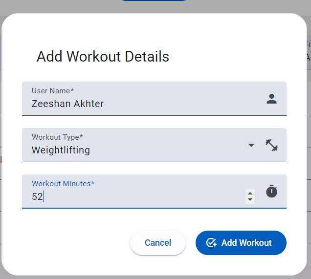
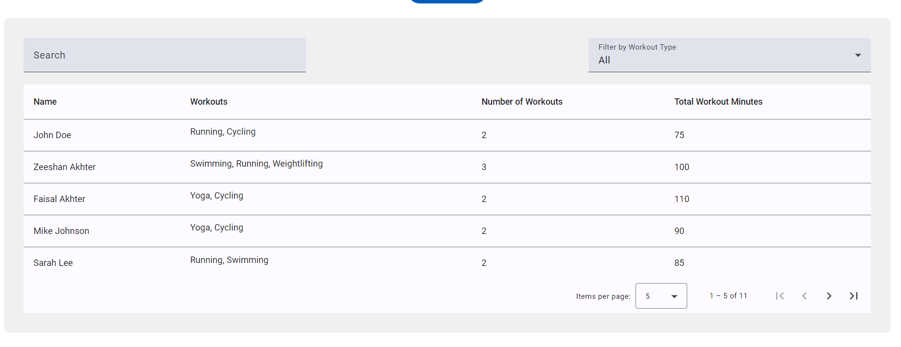
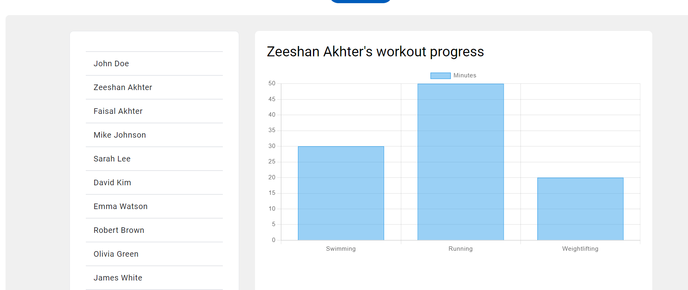
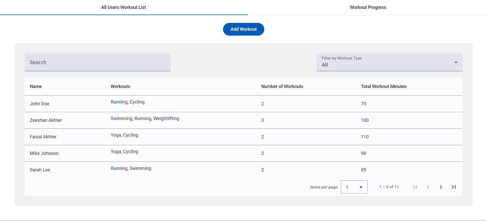
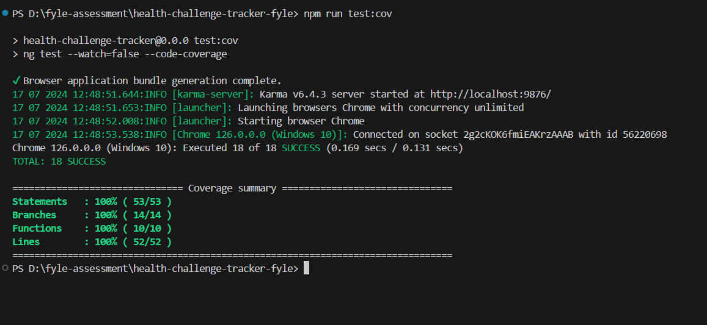

# Health Challenge Tracker

Fyle Frontend Development Challenge - July 2024.

This project is built with [Angular CLI](https://github.com/angular/angular-cli) version 14+.

## Overview

Created a single-page application (SPA) using Angular 14+ to track user workouts.

## Repository and Deployment

- The project repository can be found [here](https://github.com/zeeshan-akhter/health-challenge-tracker-fyle/).
- The live application is hosted [here](https://health-challenge-tracker-fyle.vercel.app/).


## Application Demo







## Code Coverage

Achieved 100% code coverage for one component (`add-user.component.ts`) and one service (`add-user.service.ts`). The code coverage report is detailed in the included spec files.



## Getting Started

### Prerequisites

- Clone the repository.
- Install dependencies with `npm install`.

### Development Server

- Run `ng serve` to start the development server.
- Navigate to `http://localhost:4200/`. The application will automatically reload when source files are changed.

### Code Scaffolding

- Run `ng generate component component-name` to generate a new component.
- Other options include `ng generate directive|pipe|service|class|guard|interface|enum|module`.

### Building the Project

- Run `ng build` to build the project.
- The build artifacts will be stored in the `dist/` directory.

### Running Unit Tests

- Run `ng test` or `npm run test` to execute unit tests via [Karma](https://karma-runner.github.io).
- For a code coverage report, run `npm run test:cov`.

## Features

### Input Fields

- Collect user details: User name, Workout type, and Workout minutes.
- Button to add workouts.

### User Workout List

- Display a list of users and their workout sessions in a table.
- Search functionality to find users by name.
- Filter workouts by type.
- Pagination for lists exceeding 5 users.

### Optional Feature

- Display workout progress using charts.

## Implementation Details

- **Input Fields**:
  - Click `Add Workout` button to open a dialog for adding workouts.
  - Fields for entering user name, workout type, and workout minutes.
  - Submit button to add the workout.

- **Initial Data**:
  - Pre-loaded with 10 users stored in localStorage.
  - Data format:
    ```js
    const userData = [
      {
        id: 2,
        name: 'Zeeshan Akhter',
        totalMinutes: 75,
        totalWorkouts: 2,
        workouts: [
          { type: 'Running', minutes: 30 },
          { type: 'Cycling', minutes: 45 }
        ]
      },
      ...
    ];
    ```

- **Table Grid**:
  - Display users and their workout details.
  - Search by name and filter by workout type.
  - Pagination for lists with more than 5 users.

- **Unit Tests**:
  - 100% code coverage for `add-user.component.ts` and `add-user.service.ts`.
  - Code coverage report included in README.

- **Libraries Used**:
  - Angular Material for UI components.
  - Chart.js for displaying workout progress.

- **Styling**:
  - Tailwind CSS for custom styling.

- **Deployment**:
  - Application hosted on Vercel.

- **Optional Features**:
  - Added charts to visualize workout progress.
  - Tabs for easy navigation between the workout list and progress chart.
  - Snackbar notifications for user feedback.

- **Assumptions**:
  - After adding a workout, switch tabs and click on the user to view the progress chart.

Feel free to explore and contribute to the project!
